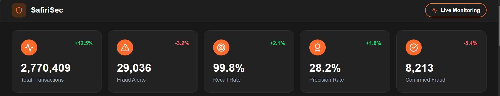
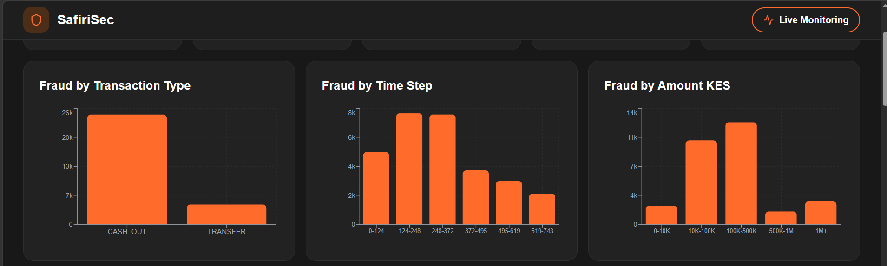
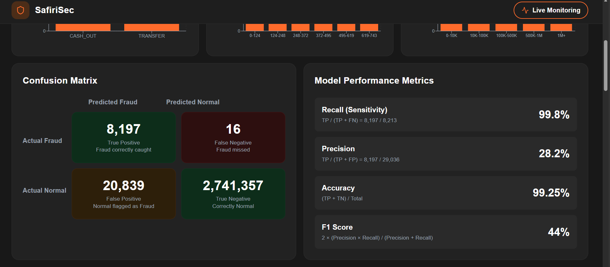
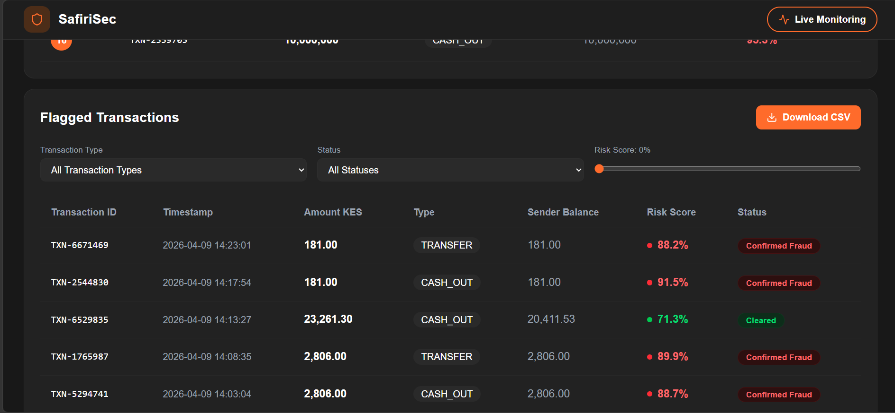

# SafiriSec
### Mobile Money Fraud Detection & Visualization Dashboard

> A cloud native machine learning system that detects suspicious mobile money transactions and visualizes fraud patterns through an interactive web dashboard built for the African fintech context.

---

## Overview

Mobile money platforms like Mpesa process millions of transactions daily across Africa. SafiriSec simulates how a real-world fraud detection system would flag and analyze suspicious activity within such an ecosystem.

Built using the **PaySim synthetic dataset** - a realistic simulation of Mpesa style transactions - SafiriSec combines machine learning, data analysis, and a modern React dashboard to surface fraud patterns in an interpretable and actionable way.

---

## Dashboard Preview

| Metric Cards | Fraud Charts |
|---|---|
|  |  |

| Confusion Matrix | Flagged Transactions |
|---|---|
|  |  |

---

## Tech Stack

| Layer | Technology |
|---|---|
| Dataset | PaySim (synthetic M-Pesa transactions) |
| Data Processing | Python, Pandas |
| Machine Learning | XGBoost |
| Backend API | Flask (Python) |
| Frontend Dashboard | React + Vite |
| Model Storage | Pickle (.pkl) |
| Version Control | Git + GitHub |

---

## Model Performance

| Metric | Score |
|---|---|
| Recall (Sensitivity) | **99.8%** |
| Precision | 28.2% |
| Accuracy | 99.25% |
| F1 Score | 44% |

> **Why is recall prioritized over precision?**
> In fraud detection, missing a real fraud case is far more costly than flagging a false alarm. The model is deliberately tuned to maximize recall - catching nearly all fraud - accepting more false positives as a conscious tradeoff. This mirrors how production fraud systems operate in real banking environments.

---

## Project Structure

```
SafiriSec/
├── data/                  # Dataset (not included - see setup)
├── models/                # Trained XGBoost model (fraud_model.pkl)
├── notebooks/
│   ├── 01_eda.ipynb       # Exploratory Data Analysis
│   └── 02_model.ipynb     # Model training & evaluation
├── public/                # Static assets (favicon, icons)
├── src/                   # React frontend source code
├── api.py                 # Flask backend API
├── index.html             # App entry point
├── requirements.txt       # Python dependencies
└── package.json           # Node dependencies
```

---

## Getting Started

### Prerequisites
- Python 3.8+
- Node.js 18+
- npm

### 1. Clone the repository
```bash
git clone https://github.com/Risperwanjiku/SafiriSec.git
cd SafiriSec
```

### 2. Download the dataset
Download the PaySim dataset from Kaggle:
https://www.kaggle.com/datasets/ealaxi/paysim1

Place the CSV file inside the `data/` folder.

### 3. Set up Python environment
```bash
python -m venv safirisec
safirisec\Scripts\activate        # Windows
source safirisec/bin/activate     # Linux/Mac
pip install -r requirements.txt
```

### 4. Run the Flask backend
```bash
python api.py
```

### 5. Run the React frontend
```bash
npm install
npm run dev
```

Open your browser at `http://localhost:5173`

---

## Key Findings

- Only **CASH_OUT** and **TRANSFER** transaction types produce fraud in the dataset
- Fraud peaks between **hours 124-372** (mid-month activity)
- Most fraud occurs in the **0-10K KES** range (small, harder to detect)
- A secondary spike exists at **1M+ KES** (large-scale fraud)
- The dataset has a severe class imbalance - only **0.13%** of transactions are fraudulent

